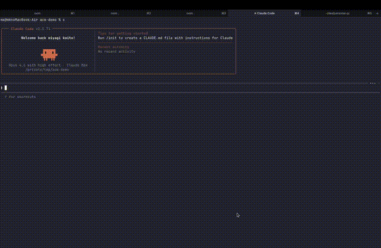
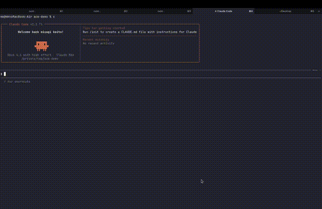

# AI CLI MCP Server

[](https://www.npmjs.com/package/ai-cli-mcp)
[](/CHANGELOG.md)

[🇯🇵 日本語のREADMEはこちら](./README.ja.md)

> **📦 Package Migration Notice**: This package was formerly `@mkxultra/claude-code-mcp` and has been renamed to `ai-cli-mcp` to reflect its expanded support for multiple AI CLI tools.

An MCP (Model Context Protocol) server that allows running AI CLI tools (Claude, Codex, Gemini, Forge, OpenCode, Grok, and Pi) in background processes with automatic permission handling.

Did you notice that Cursor sometimes struggles with complex, multi-step edits or operations? This server, with its powerful unified `run` tool, enables multiple AI agents to handle your coding tasks more effectively.

## Demo

[](https://github.com/mkXultra/ai-cli-mcp/releases/download/v2.11.0/demo.mp4)

## Overview

This MCP server provides tools that can be used by LLMs to interact with AI CLI tools. When integrated with MCP clients, it allows LLMs to:

- Run Claude CLI with all permissions bypassed (using `--dangerously-skip-permissions`)
- Execute Codex CLI with approvals and sandbox bypassed (using `--dangerously-bypass-approvals-and-sandbox`)
- Execute Gemini models through Antigravity CLI (`agy --print`, `stream-json`, and `--dangerously-skip-permissions`)
- Execute Forge CLI in non-interactive mode (using `forge -C <workFolder> -p <prompt>`)
- Execute Grok Build CLI headlessly with `streaming-messages-json`, automatic tool approval, and automatic updates disabled
- Execute OpenCode in non-interactive JSON mode (using `opencode run --format json --dir <workFolder> <prompt>`)
- Execute Pi in non-interactive JSON mode with tool approval enabled for unattended runs
- Support multiple AI models: Claude (sonnet, sonnet[1m], opus, opusplan, fable, haiku), Codex (gpt-6-astra, gpt-6-sol, gpt-6-luna, gpt-5.4, gpt-5.6-sol, gpt-5.6-terra, gpt-5.6-luna, gpt-5.5, gpt-5.4-mini, gpt-5.3-codex, gpt-5.3-codex-spark, gpt-5.2), Gemini (gemini-3.8-flash-high/medium/low, gemini-3.7-flash-high/medium/low, gemini-3.6-flash-high/medium/low, gemini-3.1-pro-high/low), Forge (`forge`), Grok (`grok`, `grok-4.6`, `grok-4.5`), OpenCode (`opencode` plus `oc-<provider/model>`), and Pi (`pi` plus `pi-<provider/model>`)
- Manage background processes with PID tracking
- Parse and return structured outputs from both tools

### Usage Example (Advanced Parallel Processing)

You can instruct your main agent to run multiple tasks in parallel like this:

> Launch agents for the following 3 tasks using acm mcp run:
> 1. Refactor `src/backend` code using `sonnet`
> 2. Create unit tests for `src/frontend` using `gpt-5.3-codex`
> 3. Update docs in `docs/` using `gemini-3.1-pro-high`
>
> While they run, please update the TODO list. Once done, use the `wait` tool to wait for all completions and report the results together.

### Usage Example (Context Caching & Sharing)

You can reuse heavy context (like large codebases) using session IDs to save costs while running multiple tasks.

> 1. First, use `acm mcp run` with `opus` to read all files in `src/` and understand the project structure.
> 2. Use the `wait` tool to wait for completion and retrieve the `session_id` from the result.
> 3. Using that `session_id`, run the following two tasks in parallel with `acm mcp run`:
>    - Create refactoring proposals for `src/utils` using `sonnet`
>    - Add architecture documentation to `README.md` using `gpt-5.3-codex`
> 4. Finally, `wait` again to combine both results.

[](https://github.com/mkXultra/ai-cli-mcp/releases/download/v2.11.0/demo-resume.mp4)

## Benefits

- **True Async Multitasking**: Agent execution happens in the background, returning control immediately. The calling AI can proceed with the next task or invoke another agent without waiting for completion.
- **CLI in CLI (Agent in Agent)**: Directly invoke powerful CLI tools like Claude Code or Codex from any MCP-supported IDE or CLI. This enables broader, more complex system operations and automation beyond host environment limitations.
- **Freedom from Model/Provider Constraints**: Freely select and combine the "strongest" or "most cost-effective" models from Claude, Codex (GPT), Gemini, Forge, OpenCode, Grok, and Pi without being tied to a specific ecosystem.

## Prerequisites

The only prerequisite is that the AI CLI tools you want to use are locally installed and correctly configured.

- **Claude Code**: `claude doctor` passes, and execution with `--dangerously-skip-permissions` is approved (you must run it manually once to login and accept terms).
- **Codex CLI** (Optional): Installed and initial setup (login etc.) completed.
- **Antigravity CLI** (Optional, for Gemini models): Install `agy` and sign in once; tested with 1.2.5. See the migration instructions below.
- **Forge CLI** (Optional): Installed and initial setup completed.
- **Grok Build CLI** (Optional): Install and authenticate Grok locally (tested with 1.0.13 and OAuth). Discovery checks `~/.grok/bin/grok`, then `PATH`; `GROK_CLI_NAME` overrides either with a command name or absolute path.
- **OpenCode** (Optional): Installed and configured. This integration uses `opencode run --format json`, and explicit provider/model selection follows the `oc-<provider/model>` wrapper syntax exposed by `ai-cli models`.
- **Pi** (Optional): Install and authenticate Pi locally (tested with 0.86.1). Run `pi --list-models` to see the provider/model pairs available to your account. `PI_CLI_NAME` overrides the binary name or path.

## Installation & Usage

### Antigravity CLI for Gemini models

The Gemini backend uses Google's [Antigravity CLI](https://antigravity.google/docs/cli/install/) (`agy`, tested with 1.2.5). On macOS/Linux:

```sh
curl -fsSL https://antigravity.google/cli/install.sh | bash
~/.local/bin/agy  # Sign in once interactively
agy models
ai-cli run --cwd /path/to/project --model gemini-ultra --prompt "Review this project"
```

On Windows, follow the official PowerShell instructions. Discovery checks `~/.local/bin/agy` on macOS/Linux or `%LOCALAPPDATA%/agy/bin/agy.exe` on Windows, then `PATH`. Set `ANTIGRAVITY_CLI_NAME` to override this path.

The backend key remains `gemini` in `doctor`, `models`, and process results. The built-in `gemini-ultra` selects `gemini-3.8-flash-high`. Update custom aliases targeting old Gemini CLI names with `ai-cli alias add`; `agy models` lists the names available to your account. A supplied `reasoning_effort` must match the model suffix (for example, `gemini-3.8-flash-medium` with `medium`). Other Antigravity model families are not routed through this backend.

`peek` reads incremental assistant text and optional tool start/completion events. `get_result`/`ai-cli result` return the final response and expose Antigravity's `conversation_id` as `session_id`; pass it to the next run to resume with `--conversation`. Old Gemini CLI output parsing and session resumption are not supported.

This integration sets Antigravity's run limit to two hours (`2h`) by default. Set `ANTIGRAVITY_PRINT_TIMEOUT=1h` (or another positive duration) in the environment of ai-cli or the MCP server to override it. Antigravity's `0` means an immediate timeout. ACM `wait(timeout: 0)` only removes the waiting deadline and does not change this separate run limit.

There are now two primary ways to use this package:

- `ai-cli-mcp`: MCP server entrypoint
- `ai-cli`: human-facing CLI for background AI runs

### MCP usage with `npx`

The recommended way to use the MCP server is via `npx`.

#### Using npx in your MCP configuration:

```json
    "ai-cli-mcp": {
      "command": "npx",
      "args": [
        "-y",
        "ai-cli-mcp@latest"
      ]
    },
```

#### Using Claude CLI mcp add command:

```bash
claude mcp add ai-cli '{"name":"ai-cli","command":"npx","args":["-y","ai-cli-mcp@latest"]}'
```

### Human CLI usage with global install

If you want to use the production CLI directly from your shell, install the package globally:

```bash
npm install -g ai-cli-mcp
```

This exposes both commands:

- `ai-cli`
- `ai-cli-mcp`

Examples:

```bash
ai-cli doctor
ai-cli models
ai-cli run --cwd "$PWD" --model sonnet --prompt "summarize this repository"
ai-cli run --cwd "$PWD" --model opencode --prompt "summarize this repository with OpenCode defaults"
ai-cli run --cwd "$PWD" --model oc-openai/gpt-5.4 --session-id ses_123 --prompt "continue this session with an explicit OpenCode model"
ai-cli run --cwd "$PWD" --model pi-openai-codex/gpt-6-astra --reasoning-effort high --prompt "review this repository with Pi"
ai-cli ps
ai-cli result 12345
ai-cli result 12345 --verbose
ai-cli peek 12345 --time 10
ai-cli wait 12345 --timeout 300
ai-cli wait 12345 --timeout 0
ai-cli wait 12345 --verbose
ai-cli kill 12345
ai-cli cleanup
ai-cli-mcp
```

### Human CLI usage with `npx`

Because the published package name is still `ai-cli-mcp`, the shortest `npx` form for the CLI is:

```bash
npx -y --package ai-cli-mcp@latest ai-cli run --cwd "$PWD" --model sonnet --prompt "hello"
npx -y --package ai-cli-mcp@latest ai-cli run --cwd "$PWD" --model oc-openai/gpt-5.4 --prompt "hello from OpenCode"
```

## Important First-Time Setup

### For Claude CLI:

**Before the MCP server can use Claude, you must first run the Claude CLI manually once with the `--dangerously-skip-permissions` flag, login and accept the terms.**

```bash
npm install -g @anthropic-ai/claude-code
claude --dangerously-skip-permissions
```

Follow the prompts to accept. Once this is done, the MCP server will be able to use the flag non-interactively.

### For Codex CLI:

**For Codex, ensure you're logged in and have accepted any necessary terms:**

```bash
codex login
```

### For Antigravity CLI (Gemini):

**Start Antigravity once interactively to sign in:**

```bash
agy
```

macOS might ask for folder permissions the first time any of these tools run. If the first run fails, subsequent runs should work.

## CLI Commands

`ai-cli` currently supports:

- `run`
- `ps`
- `result`
- `peek`
- `wait`
- `kill`
- `cleanup`
- `doctor`
- `models`
- `alias list` / `alias add` / `alias rm`
- `mcp`

Example flow:

```bash
ai-cli doctor
ai-cli models
ai-cli run --cwd "$PWD" --model gpt-5.4 --prompt "use the default Codex model"
ai-cli run --cwd "$PWD" --model codex-ultra --prompt "fix failing tests"
ai-cli run --cwd "$PWD" --model opencode --session-id ses_existing --prompt "continue this OpenCode session"
ai-cli run --cwd "$PWD" --model oc-openai/gpt-5.4 --prompt "run with an explicit OpenCode backend model"
ai-cli run --cwd "$PWD" --model pi --prompt "run with Pi's configured default model"
ai-cli run --cwd "$PWD" --model pi-openai-codex/gpt-6-astra --reasoning-effort xhigh --prompt "run Pi with an explicit model"
ai-cli ps
ai-cli peek 12345 --time 10
ai-cli peek 12345 12346 --time 10
ai-cli wait 12345
ai-cli wait 12345 --verbose
ai-cli result 12345
ai-cli result 12345 --verbose
ai-cli cleanup
```

`run` accepts `--cwd` as the primary working-directory flag and also accepts the older aliases `--workFolder` / `--work-folder` for compatibility.

OpenCode model selection accepts either:

- `opencode` for the CLI's configured default model
- `oc-<provider/model>` for an explicit OpenCode provider/model, for example `oc-openai/gpt-5.4`

`ai-cli models` runs `opencode models` and returns `opencode` plus discovered names such as `oc-openai/gpt-6-astra` in the `opencode` array. Each name can be passed directly to `run`. Discovery status and errors are available in `dynamicModelBackends.opencode.discovery`.

Codex model selection uses `gpt-5.4` as the default advertised model. Select `gpt-6-sol` for the new Sol model or `gpt-6-luna` for the new Luna model. Both accept `low`, `medium`, `high`, `xhigh`, and `max` reasoning; Sol also accepts `ultra`. For example: `ai-cli run --cwd "$PWD" --model gpt-6-sol --reasoning-effort ultra --prompt "Review this project"`.

`doctor` checks only binary availability and path resolution. Its JSON output includes a `checks` block that marks login state and terms acceptance as unchecked.

## Pi CLI

Install Pi and sign in once before starting ai-cli or the MCP server. This integration was verified with Pi 0.86.1.

```sh
npm install -g --ignore-scripts @earendil-works/pi-coding-agent
pi                    # use /login if authentication is not configured
pi --list-models
```

Use `pi` to let Pi select its configured default model. Use `pi-<provider/model>` for an explicit model, for example `pi-openai-codex/gpt-6-astra`. `ai-cli models` runs `pi --list-models` and includes these names after `pi` in its `pi` array. `dynamicModelBackends.pi.discovery` reports discovery status; `reasoningEfforts.pi` lists `off`, `minimal`, `low`, `medium`, `high`, `xhigh`, and `max`. Omitting `reasoning_effort` leaves the choice to Pi.

```sh
ai-cli run --cwd "$PWD" --model pi --prompt "Explain this project"
ai-cli run --cwd "$PWD" --model pi-openai-codex/gpt-6-astra --reasoning-effort xhigh --prompt "Review this change"
ai-cli alias add pi-coding pi-openai-codex/gpt-5.6-terra --effort high
ai-cli run --cwd "$PWD" --model pi-coding --session-id <session_id> --prompt "Continue"
```

Runs use `pi --mode json --approve`, optional `--model`, `--thinking`, and `--session`, followed by `-p -- <prompt>`. The `--approve` flag lets Pi load project resources and execute its configured tools without an interactive confirmation. The existing `workFolder` and process isolation rules still apply.

`peek` accumulates Pi `text_delta` events and optionally reports normalized `tool_execution_start` / `tool_execution_end` events. Thinking deltas, tool updates, and raw tool output are excluded. `get_result` and `wait` return the final text, provider, model, usage, stop reason, and Pi session ID. Passing that ID to the next run resumes the same session with `--session`. Verbose results include detailed tool history; compact results omit it. Failed runs preserve diagnostic stderr, and cancellation uses the same process-tree termination used for Grok and Antigravity.

## Grok Build CLI

See the [Grok headless guide](https://docs.x.ai/build/cli/headless-scripting) for authentication and CLI setup.

With no user alias named `grok`, both MCP and `ai-cli` route `grok` and native `grok-*` names to Grok. `grok` omits `--model`, using the Grok CLI configuration; explicit names select that model. `models` includes `grok: ["grok", "grok-4.6", "grok-4.5"]` and `reasoningEfforts.grok` with the accepted levels. Other native names are forwarded, with common low/medium/high effort validation; model availability is determined by Grok.

```sh
ai-cli run --cwd "$PWD" --model grok --prompt "Explain this project"
ai-cli run --cwd "$PWD" --model grok-4.6 --reasoning-effort xhigh --prompt "Review this change"
ai-cli alias add grok-coding grok-4.6 --effort high
ai-cli run --cwd "$PWD" --model grok-coding --session-id <session_id> --prompt "Continue"
```

A preexisting user alias named `grok` keeps precedence, including aliases that target OpenCode. It remains visible in `models` and `alias list` and does not affect unrelated runs or MCP tool discovery. Explicit `grok-4.6` / `grok-4.5` always select the native backend. To use the CLI-configured provider default, rename that alias or explicitly remove it with `ai-cli alias rm grok`; upgrades never edit your configuration.

The same alias and `model`, `reasoning_effort`, and `session_id` fields work in MCP `run`. Aliases use the existing user configuration. With no effort supplied, Grok decides the effort. The provider key `grok` accepts low/medium/high; select `grok-4.6` explicitly for xhigh. `grok-4.5` accepts low/medium/high. Neither accepts max or ultra.

Commands use `grok --single=<prompt> --cwd <workFolder> --output-format streaming-messages-json --always-approve --no-auto-update`, plus optional model, effort, and `--resume=<session_id>`. Attached values preserve leading hyphens and newlines. At the ai-cli surface use `--prompt="--text"` / `--session-id="--id"` for values starting with `--`, or use a prompt file. This follows the existing unattended tool approval policy. Authenticate with Grok before use; `doctor.grok` checks binary discovery only. The Grok 1.0.13 `models` command can show an unauthenticated banner even when OAuth headless execution works, so that banner is not used as an authentication test.

`peek` observes whole assistant messages during the call, plus optional normalized tool start/completion events. Thinking, token deltas, and raw tool output are excluded. `get_result` and `wait` return the final answer and session ID, or available assistant text while running. When present, Grok model/usage/cost metadata and terminal `is_error`, `subtype`, `errors`, and `stop_reason` are retained. Failures also preserve diagnostic `stderr`, including after a partial answer. Verbose results include detailed tools. `kill`/`kill_process` terminate the tracked process and its tool descendants; POSIX cancellation uses `ps` and signals, and Windows uses `taskkill /t /f`. If `ps` is unavailable, it still signals the tracked PID and its owned group, verifies exit and escalates to SIGKILL if needed; the kill response and failure stderr warn that descendants in other groups may survive. The MCP host stops tracked work on SIGINT/SIGTERM/SIGHUP and stdin/transport closure. Group signals target only groups created for tracked work, never the MCP host group.

During MCP cancellation, the Grok root may report `failed`/143 while its tool descendants are still stopping. Overlapping `kill_process` calls and host shutdown await the same tree termination; `cleanup_processes` retains the entry until that operation settles. If the first signal fails before any signal is delivered, the error is returned and later natural completion keeps its actual status and exit code.

## User Model Aliases

Save a model and its default reasoning effort under a name you can use across projects. CLI and MCP share the same user configuration.

### Manage and use aliases from the CLI

```bash
ai-cli alias add codex-coding gpt-5.6-terra --effort xhigh
ai-cli alias add claude-review opus --effort max
ai-cli alias list
ai-cli run --cwd "$PWD" --model codex-coding --prompt "fix failing tests"
```

Here, `codex-coding` runs `gpt-5.6-terra` with `xhigh` reasoning. Override the effort for a single run with `--reasoning-effort low`.

`alias list` prints JSON with `configPath` and an `aliases` array containing the effective built-in and user aliases. Each entry has `name`, `resolvesTo`, `agent`, and optional `defaultReasoningEffort`, matching the aliases in `ai-cli models`. Listing does not create or modify the config file. Use `ai-cli models` to include the supported model catalog as well.

`alias add <name> <model> [--effort <level>]` creates the config file and its parent directories if needed, including an explicitly selected `AI_CLI_CONFIG_PATH`. Reusing a name replaces its definition; omitting `--effort` clears any previous alias effort. `--reasoning-effort` and `--reasoning_effort` are also accepted. Invalid definitions leave the file unchanged.

```bash
# Update the default effort
ai-cli alias add codex-coding gpt-5.6-terra --effort high
# Clear the alias effort and use the target CLI's default
ai-cli alias add codex-coding gpt-5.6-terra
# Remove the user alias
ai-cli alias rm codex-coding
```

`alias rm <name>` removes only a user definition. Removing an override such as `codex-ultra` restores the built-in default. Removing an unknown name or a built-in alias without a user override returns an error. Successful commands print JSON with the config path and the change made. Use `ai-cli alias --help` for usage.

```bash
# Override a built-in alias
ai-cli alias add codex-ultra gpt-5.6-terra --effort xhigh
# Restore its built-in gpt-6-astra / ultra definition
ai-cli alias rm codex-ultra
```

### Use aliases through MCP

After registering `codex-coding` as above, pass its name to the MCP `run` tool:

```json
{
  "workFolder": "/absolute/path/to/project",
  "model": "codex-coding",
  "prompt": "fix failing tests"
}
```

Add `"reasoning_effort": "low"` to override the effort for that request. `ai-cli models` and the MCP `models` tool expose the effective aliases as `aliases` entries with `name`, `resolvesTo`, `agent`, and optional `defaultReasoningEffort` fields.

Config is read for each `run`, `models`, and MCP tool-list request. Changes apply to subsequent requests without restarting the MCP server, provided CLI and MCP use the same config path.

### Configuration file and rules

The commands above edit `~/.config/ai-cli/config.json`. You can also edit it directly; for example, this file defines both aliases from the first example:

```json
{
  "model_aliases": {
    "codex-coding": {
      "model": "gpt-5.6-terra",
      "reasoning_effort": "xhigh"
    },
    "claude-review": {
      "model": "opus",
      "reasoning_effort": "max"
    }
  }
}
```

- `model` is required; `reasoning_effort` is optional. The backend is selected from the target model, regardless of the alias name.
- Effort precedence is: explicit run argument → alias default → target CLI default. Effort must be supported by the target model; Antigravity effort must match the model suffix; Forge and OpenCode aliases must omit it.
- User entries can override built-in aliases such as `codex-ultra`. Each entry replaces the entire definition; omitting `reasoning_effort` uses the target CLI's default rather than inheriting the built-in effort.
- Targets must be native model names such as `gpt-5.6-terra`, `opus`, or `oc-openai/gpt-5.4`; alias chaining is not supported. Alias names are case-sensitive, start with an ASCII letter, and contain only ASCII letters, digits, `_`, or `-`. Listed native model names, `codex`, and the `oc-` prefix are reserved, except that a user alias named `grok` retains precedence for compatibility.
- Missing default config files preserve built-in behavior. Malformed files and invalid model/effort combinations produce errors with the config path. A missing explicitly configured file also produces an error, except that `alias add` can create it.

An absolute `XDG_CONFIG_HOME` changes the default location to `$XDG_CONFIG_HOME/ai-cli/config.json`. `AI_CLI_CONFIG_PATH` overrides that location entirely; relative paths are resolved from the CLI/MCP process's working directory. For an MCP-specific path, set `AI_CLI_CONFIG_PATH` in the server's `env` settings. There is no project-level config lookup. The file uses JSON without comments and currently supports only `model_aliases`.

## CLI State Storage

Background CLI runs are stored under:

```text
~/.local/state/ai-cli/cwds/<normalized-cwd>/<pid>/
```

Each PID directory contains:

- `meta.json`
- `stdout.log`
- `stderr.log`
- `exit-status.json` for detached runs

Use `ai-cli cleanup` to remove completed and failed runs. Running processes are preserved.

## Exit Status Tracking

Detached `ai-cli` runs persist natural exit status for all supported backends through `exit-status.json`. Non-zero exits are surfaced as `failed` with the recorded `exitCode`; zero exits are surfaced as `completed` with `exitCode: 0`. `ai-cli kill` records SIGTERM termination as a failed exit, and a tracked process that disappears without exit metadata is treated as `failed` rather than assumed successful.

## Connecting to Your MCP Client

After setting up the server, add the configuration to your MCP client's settings file (e.g., `mcp.json` for Cursor, `mcp_config.json` for Windsurf).

If the file doesn't exist, create it and add the `ai-cli-mcp` configuration.

## Tools Provided

This server exposes the following tools:

### `run`

Executes a prompt using Claude CLI, Codex CLI, Antigravity CLI (Gemini), Forge CLI, OpenCode, Grok, or Pi. The appropriate CLI is automatically selected based on the model name.

**Arguments:**
- `prompt` (string, optional): The prompt to send to the AI agent. Either `prompt` or `prompt_file` is required.
- `prompt_file` (string, optional): Path to a file containing the prompt. Either `prompt` or `prompt_file` is required. Can be absolute path or relative to `workFolder`.
- `workFolder` (string, required): The working directory for the CLI execution. Must be an absolute path.
**Models:**
- **Ultra Aliases (built-in defaults; user config can override):** `claude-ultra` (`opus`, defaults to max effort and does not select Fable), `codex-ultra` (`gpt-6-astra`, defaults to ultra reasoning), `gemini-ultra`
- Claude: `sonnet`, `sonnet[1m]`, `opus`, `opusplan`, `fable`, `haiku`
  - `fable` explicitly selects Claude Code's latest Fable model. Fable may require separately billed usage credits and is not selected by the built-in `claude-ultra` default.
- Codex: `gpt-6-astra`, `gpt-6-sol`, `gpt-6-luna`, `gpt-5.4`, `gpt-5.6-sol`, `gpt-5.6-terra`, `gpt-5.6-luna`, `gpt-5.5`, `gpt-5.4-mini`, `gpt-5.3-codex`, `gpt-5.3-codex-spark`, `gpt-5.2`
- Gemini: `gemini-3.8-flash-high`, `gemini-3.8-flash-medium`, `gemini-3.8-flash-low`, Gemini 3.7/3.6 Flash variants, `gemini-3.1-pro-high`, `gemini-3.1-pro-low`
- Forge: `forge`
- Grok: `grok` for its configured default, `grok-4.6`, `grok-4.5`, and other native `grok-*` names
- OpenCode: `opencode` for the configured default backend model, plus explicit wrappers like `oc-openai/gpt-5.4`
- Pi: `pi` for its configured default model, plus explicit wrappers like `pi-openai-codex/gpt-6-astra`
- `reasoning_effort` (string, optional): Reasoning control for Claude, Codex, Grok, and Pi. Pi maps `off|minimal|low|medium|high|xhigh|max` to `--thinking`. Grok uses `--reasoning-effort`: `grok-4.6` supports low/medium/high/xhigh; `grok-4.5`, the `grok` configured default, and other native Grok names accept low/medium/high. Omit effort to use the CLI default; max/ultra are rejected for Grok. Claude uses `--effort` (allowed: "low", "medium", "high", "xhigh", "max"). Codex uses `model_reasoning_effort` (base levels: "low", "medium", "high", "xhigh"; GPT-6 Astra/Sol and GPT-5.6 Sol/Terra also support "max" and "ultra", while GPT-6 Luna and GPT-5.6 Luna support "max"). Antigravity accepts `--effort low|medium|high`, which must match the model name suffix when present. Forge and OpenCode do not support `reasoning_effort`.
- `session_id` (string, optional): Optional session ID to resume a previous session. Supported for Claude, Codex, Gemini, Forge, OpenCode, Grok, and Pi. Grok resumes via `--resume`; OpenCode and Pi resume in place via `--session` and may also be combined with explicit model selection.

### `wait`

Waits for multiple AI agent processes to complete and returns their combined results. Blocks until all specified PIDs finish or a timeout occurs.

Set `timeout` to `0` to wait until all specified processes finish without an ai-cli deadline. For example, call MCP `wait` with `{ "pids": [12345], "timeout": 0 }`, or use `ai-cli wait 12345 --timeout 0`. MCP client or transport timeouts still apply independently. A finite wait timeout returns an error and leaves the processes running.

By default, each returned result item uses the compact shape shared with `get_result(verbose: false)`: operational fields such as `pid`, `agent`, `status`, `exitCode`, `model`, parsed output such as `agentOutput`, and top-level `session_id` when available. Set `verbose: true` to include full metadata like `startTime`, `workFolder`, `prompt`, and detailed parsed output such as `agentOutput.tools`.

**Arguments:**
- `pids` (array of numbers, required): List of process IDs to wait for (returned by the `run` tool).
- `timeout` (number, optional): Non-negative maximum wait time in seconds. Defaults to 180 (3 minutes); `0` disables the wait timeout.
- `verbose` (boolean, optional): If `true`, each result item uses the full result shape. Defaults to `false`.

### `peek`

Starts a one-shot short observation window for running child agents and returns structured events observed during that specific call. By default this includes only natural-language message events; pass `include_tool_calls` or `--include-tool-calls` to also include normalized tool-call events. It is not a history API, not gapless streaming, and not shell stdout/stderr tailing. Separate `peek` calls may miss events emitted between calls; `--follow` is intentionally not part of v1.

CLI v1:

```bash
ai-cli peek 123 --time 10
ai-cli peek 123 456 --time 10
ai-cli peek 123 --time 10 --include-tool-calls
```

**Arguments:**
- `pids` (array of numbers, required): 1..32 process IDs returned by `run`. Duplicate PIDs are deduplicated server-side, preserving first occurrence order. Unknown or unmanaged PIDs are returned per process as `not_found`, not as a whole-call failure.
- `peek_time_sec` (number, optional): Positive integer observation length in seconds. Defaults to 10 and is capped at 60. `0`, negative values, and fractional values are invalid.
- `include_tool_calls` (boolean, optional): When `true`, each process `events` array includes normalized `tool_call` events in addition to message events. Defaults to `false`.

**Observation and filtering:**
- `peek_started_at` and `events[].ts` are ai-cli-mcp server-side UTC RFC3339 timestamps. `peek_started_at` is when the observation window starts after validation and listener registration; `events[].ts` is when ai-cli-mcp observed and accepted the event.
- The window ends when `peek_time_sec` elapses or all target processes reach a terminal state, whichever comes first.
- Events emitted before the window starts are not returned. Concurrent `peek` calls for the same PID are allowed; each has an independent window and may return overlapping events.
- Message events are recognized from Codex `agent_message` text, Claude and Grok whole assistant text content, OpenCode `type: "text"` events where `part.type` is `"text"`, Antigravity `step_update` events, Pi `text_delta` events, and best-effort Forge plain-text lines beginning with `Summary:` or `Completed successfully:`.
- When tool calls are included, `tool_call` events are normalized for Codex command/MCP calls, Claude/Grok tool use/results, Antigravity tool steps, OpenCode tool use, Pi tool execution start/end events, and low-precision Forge `Execute`/`Finished` markers. Tool summaries are bounded one-line strings derived from tool names and input metadata only. Raw tool and command output is excluded.
- Unknown event shapes are denied by default. Managed agents without supported extraction return their real process status with `events: []`, `truncated: false`, and `error: null`.
- Each PID keeps the first 50 events observed in the window. If later events are dropped, `truncated` is `true`.
- `status` is one of `running`, `completed`, `failed`, or `not_found`, and reflects state when the observation window closes.
- `agent` is `claude`, `codex`, `gemini`, `forge`, `opencode`, `grok`, `pi`, a future tracked string value, or `null` when the process is not found or the agent cannot be determined.

Example response:

```json
{
  "peek_started_at": "2026-04-11T12:34:56.789Z",
  "observed_duration_sec": 10.01,
  "processes": [
    {
      "pid": 123,
      "agent": "codex",
      "status": "running",
      "events": [
        { "kind": "message", "ts": "2026-04-11T12:34:59.120Z", "text": "I'm checking the implementation." },
        { "kind": "tool_call", "ts": "2026-04-11T12:35:00.000Z", "phase": "started", "id": "item_0", "tool": "command_execution", "summary": "/bin/sh -c 'echo hi'" }
      ],
      "truncated": false,
      "error": null
    },
    {
      "pid": 999,
      "agent": null,
      "status": "not_found",
      "events": [],
      "truncated": false,
      "error": "process not found"
    }
  ]
}
```

### `list_processes`

Lists all running and completed AI agent processes with their status, PID, and basic info.

### `doctor`

Checks supported AI CLI binary availability and path resolution from MCP clients. Like `ai-cli doctor`, it returns a `checks` block and does not verify login state or terms acceptance.

### `models`

Lists supported model names and aliases, including models discovered by running `pi --list-models` and `opencode models`. This returns the same structured payload as `ai-cli models`. The `pi` and `opencode` arrays retain their default keys and append names ready for `run`.

The two discovery commands run concurrently with a 5-second timeout and a 1 MiB output limit per CLI. `PI_CLI_NAME` and `OPENCODE_CLI_NAME` overrides apply. Discovery uses the calling process's working directory and CLI configuration; listed models are not a guarantee of authentication or model access.

Each `dynamicModelBackends.<backend>.discovery` contains `status` (`success` or `error`), `checkedAt`, `cached`, and an `error` on failure. A missing CLI, timeout, or parsing error leaves that backend's default key and all other model lists and aliases available. An empty successful list has `status: "success"` and no additional names.

The MCP server caches discovery results, including failures, for 60 seconds and shares concurrent lookups. Each standalone `ai-cli models` invocation fetches fresh results. Changes to executable selection, working directory, or environment bypass the cache; changes to CLI config files appear after cache expiry. User aliases are read on every request. Listing MCP tools and starting runs do not trigger discovery.

The `aliases` array includes built-in defaults merged with [user model aliases](#user-model-aliases). Each entry contains `name`, `resolvesTo`, `agent`, and optional `defaultReasoningEffort`.

### `get_result`

Gets the current output and status of an AI agent process by PID.

By default, this returns the compact result shape: operational fields such as `pid`, `agent`, `status`, `exitCode`, `model`, parsed output such as `agentOutput`, and top-level `session_id` when available. It omits metadata fields like `startTime`, `workFolder`, and `prompt`. Set `verbose: true` to return the full result shape including those metadata fields and detailed parsed output such as `agentOutput.tools`. If parsed output is unavailable or incomplete, the raw `stdout`/`stderr` fallback is preserved.

**Arguments:**
- `pid` (number, required): The process ID returned by the `run` tool.
- `verbose` (boolean, optional): If `true`, returns the full result shape. Defaults to `false`.

### `kill_process`

Terminates a running AI agent process by PID.

**Arguments:**
- `pid` (number, required): The process ID to terminate.

## Troubleshooting

- **"Command not found" (claude-code-mcp):** If installed globally, ensure the npm global bin directory is in your system's PATH. If using `npx`, ensure `npx` itself is working.
- **"Command not found" (`ai-cli`):** If installed globally, ensure your npm global bin directory is in `PATH`. If using `npx`, use `npx -y --package ai-cli-mcp@latest ai-cli ...`.
- **"Command not found" (claude or ~/.claude/local/claude):** Ensure the Claude CLI is installed correctly. Run `claude/doctor` or check its documentation.
- **Permissions Issues:** Make sure you've run the "Important First-Time Setup" step.
- **JSON Errors from Server:** If `MCP_CLAUDE_DEBUG` is `true`, error messages or logs might interfere with MCP's JSON parsing. Set to `false` for normal operation.
- **ESM/Import Errors:** Ensure you are using Node.js v20 or later.

## Contributing

For development setup, testing, and contribution guidelines, see the [Development Guide](./docs/development.md).

## Testing

```bash
# Deterministic unit, parser, contract, and mocked e2e tests
npm test

# Published npm package contents smoke test
npm run test:package

# Deterministic PR/release gate used by GitHub Actions.
# This does not enable real external CLI runs by itself.
npm run test:release

# Release-time live E2E against real installed AI CLIs
ACM_LIVE_E2E=1 ACM_LIVE_E2E_AGENTS=claude,codex npm run test:live

# Release-time live E2E for both ai-cli and MCP server surfaces
ACM_LIVE_E2E=1 ACM_LIVE_E2E_SURFACE=all ACM_LIVE_E2E_AGENTS=claude,codex npm run test:live
```

Live E2E is opt-in because it depends on installed and authenticated external CLIs, network access, provider availability, and cost budget. `ACM_LIVE_E2E_SURFACE` defaults to `cli`; use `mcp` or `all` to include the MCP server surface.

## Advanced Configuration (Optional)

Normally not required, but useful for customizing CLI paths or debugging.

- `CLAUDE_CLI_NAME`: Override the Claude CLI binary name or provide an absolute path (default: `claude`)
- `CODEX_CLI_NAME`: Override the Codex CLI binary name or provide an absolute path (default: `codex`)
- `ANTIGRAVITY_CLI_NAME`: Override the Antigravity binary name or absolute path (default: `agy`). The deprecated `GEMINI_CLI_NAME` is a lower-priority override and must also point to an Antigravity binary.
- `ANTIGRAVITY_PRINT_TIMEOUT`: Override Antigravity’s run limit with a positive duration such as `1h` (integration default: `2h`; `0` is not unlimited).
- `FORGE_CLI_NAME`: Override the Forge CLI binary name or provide an absolute path (default: `forge`)
- `GROK_CLI_NAME`: Override the Grok CLI binary name or absolute path (default discovery: `~/.grok/bin/grok`, then `grok` on PATH)
- `OPENCODE_CLI_NAME`: Override the OpenCode CLI binary name or provide an absolute path (default: `opencode`)
- `PI_CLI_NAME`: Override the Pi CLI binary name or provide an absolute path (default: `pi`)
- `MCP_CLAUDE_DEBUG`: Enable debug logging (set to `true` for verbose output)

**CLI Name Specification:**
- Command name only: `CLAUDE_CLI_NAME=claude-custom`
- Absolute path: `CLAUDE_CLI_NAME=/path/to/custom/claude`
*Relative paths are not supported.*

### Example with custom CLI binaries:

```json
    "ai-cli-mcp": {
      "command": "npx",
      "args": [
        "-y",
        "ai-cli-mcp@latest"
      ],
      "env": {
        "CLAUDE_CLI_NAME": "claude-custom",
        "CODEX_CLI_NAME": "codex-custom",
        "OPENCODE_CLI_NAME": "opencode-custom",
        "PI_CLI_NAME": "pi-custom"
      }
    },
```

## License

MIT
